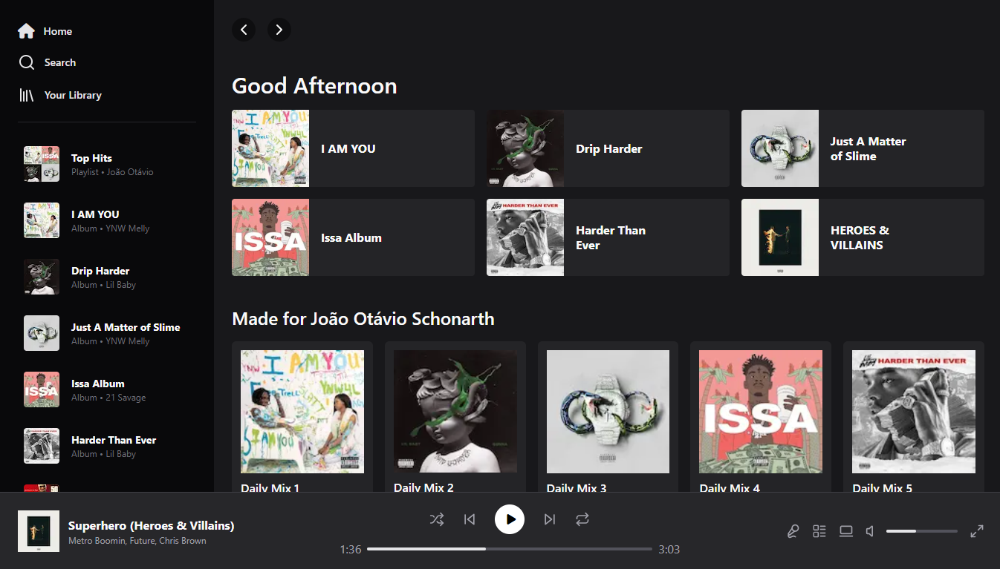

#  Spotify Clone

Este projeto é uma clonagem da página inicial do Spotify, desenvolvida com Next.js e estilizada com TailwindCSS. O objetivo é reproduzir o layout e a experiência visual da home page do Spotify para fins de aprendizado e prática com essas tecnologias.

<div align="center">



</div>

## Tecnologias Utilizadas

- **Next.js**: Framework React para renderização do lado do servidor e desenvolvimento de aplicações web modernas.
- **TailwindCSS**: Framework de CSS utilitário para estilização rápida e responsiva.

## Instalação

Siga os passos abaixo para configurar o projeto localmente:

1. **Clone o repositório**

```bash
git clone https://github.com/joschonarth/spotify-clone
```

2. **Navegue até o diretório do projeto**

```bash
cd spotify-clone
```

3. **Instale as dependências**

```bash
pnpm install
```

4. **Inicie o servidor de desenvolvimento**

```bash
pnpm dev
```

5. **Acesse o projeto no seu navegador em `http://localhost:3000`.**


## 📞 Contato 

<div>
    <a href="https://www.linkedin.com/in/joschonarth/" target="_blank"></a>
    <a href="mailto:joschonarth@gmail.com" target="_blank"></a>
</div>